# Game Design Document: Escape Vimension

## Game Overview

### Core Concept

In **Escape Vimension**, the player is a programmer who wants to write code faster with Vim. As a complete newbie, the player enters the Vim editor without knowing how to quit it. After spending hours trying to exit Vim, the player is shrunk down and trapped inside the "vimesion".

To escape back to the real world, you—the player—must master Vim, with the ultimate goal of learning how to exit and return to reality. The journey of learning Vim is not as easy as it may seem. Along the way, you discover that some programmers have never made it back.

Do you think you are built different? Can you master Vim? We will see…

---

### P.S. _What is Vim?_

Vim is a free, open-source, and highly configurable text editor that originated from the **vi** editor. Designed for efficiency and speed, it allows users to perform complex text-editing tasks entirely with keyboard commands through its command-line interface.

It is also known to have a steep learning curve, since most of us are used to relying on a mouse to move between lines. In Vim, you use the keyboard for everything!

---

### Related Genre(s)

-   **Primary Genre:** 3D Puzzle Platformer
-   **Secondary Genre:** Educational Game

**Similar Games:**

-   _Vim Adventures_ (2D browser game teaching Vim)
-   _Human Resource Machine_ (programming puzzle game)
-   _Superliminal_ (perspective/size-based puzzles)

**What Makes Us Different:**  
Unlike text-based Vim tutorials or 2D educational games, we create an immersive 3D environment where Vim commands have immediate, visible physical effects on the world. Our game also has an engaging plot and inside jokes. Learn Vim in a fun way!

---

### Target Audience

-   **Primary:** Computer science students (18–25) learning programming
-   **Secondary:** Developers wanting to learn Vim in a fun way
-   **Tertiary:** Puzzle game enthusiasts who enjoy unique mechanics

**Accessibility:** No prior Vim knowledge required—the game teaches from scratch.

---

### Unique Selling Points (USPs)

-   **Physical Vim Commands:** Transform abstract text editing into tangible 3D interactions
-   **Learn by Doing:** No boring tutorials; every command is learned through solving puzzles
-   **Terminal Aesthetic in 3D:** Unique visual style mixing retro terminal graphics with modern 3D environments

## Story and Narrative

### Backstory

You’re a college student working late on a programming project. Frustrated with your slow editing speed, you stumble upon Vim. Eager to improve, you open a terminal and type `vim .`.

Confused, you realize you have no idea how to edit code, navigate, or—most importantly—exit. In frustration, you mash through countless keyboard shortcuts, but nothing works… until you accidentally enter **Vim Tutor**. Suddenly, you’re shrunk down to the size of a microbe!

Now, the only way to return to reality is to master Vim—by following the tutor and hoping it finally teaches you how to quit.

---

### Setting

The game takes place in a fantasy world of miniatures that exists somewhere between the digital and physical worlds.

-   **Environment**

    -   Giant trees, tall grass, and oversized flowers creating natural mazes
    -   Fallen leaves, pebbles, and sticks acting as obstacles or platforms
    -   Streams, puddles, or small water hazards that must be crossed or avoided

-   **Enemies**

    -   Insects such as ants, cockroaches, spiders, or bees
    -   Mini-boss encounters: larger insects or rogue “viruses” that require command-based strategies to defeat

-   **Interactive Objects**

    -   Collectibles such as crumbs, gems, or code fragments that heal or grant new abilities
    -   Hidden shortcuts or “secret” paths that require clever use of Vim commands

---

### Characters

-   **The Player (You):** A tiny programmer trying to escape, shown as a small humanoid figure
-   **The Vim Tutor (Voice/Guide):** A mysterious creature that guides the player and teaches vim commands
-   **Lost Programmers:** Along the way, you encounter other programmers who failed to escape. They share their stories, warning that there may be no hope left

## Gameplay and Mechanics – Vim Code

### Player Perspective

The game uses a **top-down perspective**, similar to early versions of _The Legend of Zelda_ but in 3D. This allows the player to see more of the environment at once, which helps in solving puzzles.

---

### Controls

The player moves using **basic Vim commands**:

-   `h`, `j`, `k`, `l` → Move the player
-   `x` → Remove a simple object (cut it)
-   `d` → Attack or use a special power (unlocked as the game progresses)
-   `y` → "Paste": place an object from the inventory back into the world
-   `/` → Search: highlight hidden items on the map
-   `gg` → Instantly return to the game’s starting point

P.S. We will add more controls here once we finilize all abilities

---

### Progression

-   **Unlocked by default:** Movement only, plus command `x` to pick up or destroy simple obstacles.
-   **As the game progresses:** Additional abilities are unlocked; puzzles become more complex and require chaining multiple commands.
-   **Buyable commands:** Using coins, players can purchase numbers (1–9) to repeat a command multiple times, similar to Vim.

---

### Rules

-   **Health:** The player has a health bar with 10 health points. If all health is lost → **Respawn at the last checkpoint**.
-   **Target:** Progress through the world by collecting coins and other collectibles to unlock new commands and complete missions assigned by the Vim Tutor. Once all commands are unlocked, the player receives a final mission, after which they learn how to quit Vim and escape Vimension.

## World Design

_(Restrict gameplay to two axes but render in 3D → “2.5D” style)_

### Game World

---

The world is set in a fantasy village on a floating island surrounded by other smaller floating islands. The environment includes:

-   Natural elements: Giant trees, oversized flowers, rocks, and streams that create obstacles

-   Interactive environment: Levers, blocks and buttons that the player can manipulate using Vim commands

### Objects

---

-   Movable blocks and obstacles for puzzles

-   Enemies such as ants, bugs, or other creatures

-   Collectibles for healing, coins for unlocking new Vim commands

-   Puddles, spikes, small cliffs

### Physics

---

-   Player collides with enemies, obstacles, and environmental hazards (recieves damage)

-   Movable objects can be pushed, pulled, removed and placed to solve puzzles

-   Certain platforms or items may have physics-based interactions (falling, swinging, or bouncing)

## Art and Audio

The overall aesthetics of the game will be more 3D cartoon-like rather than realistic. Since our player is shrunk into an imaginary Vim world, a more fantasy-like style suits the game design better.

---

### Art Style

-   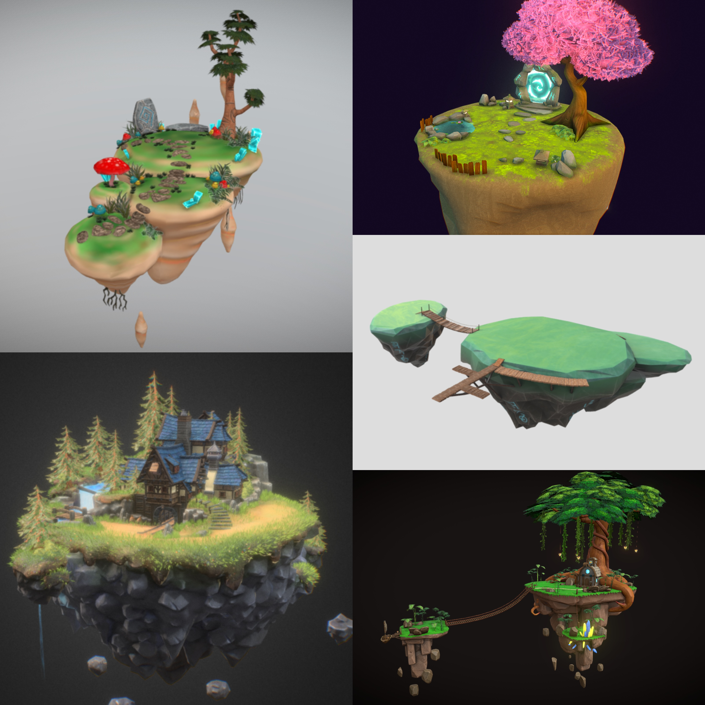
-   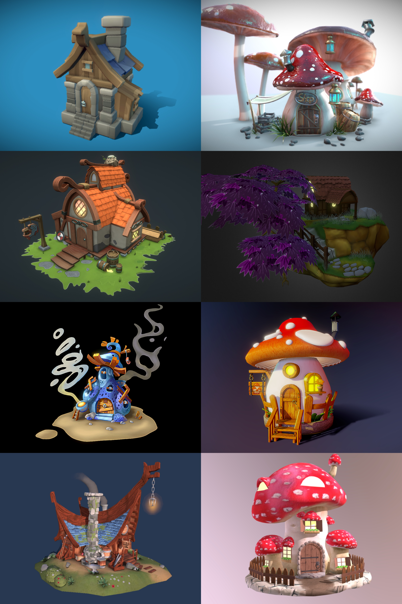

Similar game references:

-   Ary and the Secret of Seasons
-   Baldo: The Guardian Owls
-   Omno
-   Hob
-   Eternal Edge+

---

### Sound and Music

Since this game is an educational puzzle game, the music should be peaceful and calming, leaning toward a lofi style without lyrics. This helps players stay focused on learning Vim while creating a relaxed and enjoyable atmosphere.

-   **Menu page:** A mysterious soundtrack that signals the player’s transition into a fantasy world  
    File: `Audio/OldWorld.mp3`  
    [Original source](https://freetouse.com/music/zambolino/old-world)

The game’s background is set in a fantasy village, and the accompanying soundtracks evoke the atmosphere of rural village life, complementing the overall theme and aesthetics.

-   **Village music 1:** `Audio/Village.mp3`  
    [Original source](https://freetouse.com/music/pufino/village)

-   **Village music 2:** `Audio/MedievalVillage.mp3`  
    [Original source](https://freetouse.com/music/walen/medieval-village)

-   **Village music 3:** `Audio/JesterDance.mp3`  
    [Original source](https://freetouse.com/music/conquest/jester-dance)

Instead of voice acting for dialogues, we chose an immersive, lightweight, and flexible sound effect that better aligns with our puzzle/fantasy theme. Typing sounds will accompany the dialogues.

-   **Typing sound for dialogues:** `Audio/Typing.mp3`  
    [Original source](https://www.epidemicsound.com/sound-effects/tracks/11e80013-c1ae-4705-b557-8d8ff294d1ba/)

Since most of the paths in our world are covered with grass, interactions with the ground should produce forest and leaf-rustling sounds.

-   **Pick up item:** `Audio/PickUp.mp3`  
    [Original source](https://www.epidemicsound.com/sound-effects/tracks/7b34345f-8e09-4b10-925a-39fb6fbfe457/)

-   **Drop item:** `Audio/Drop.mp3`  
    [Original source](https://www.epidemicsound.com/sound-effects/tracks/90e1ad5e-aaf4-4382-a5c9-368721d2733c/)

-   **Walking:** `Audio/Walking.mp3`  
    [Original source](https://www.epidemicsound.com/sound-effects/tracks/d5ca5d74-cdc1-4b0c-ba97-9314f36f7054/)

-   **Running:** `Audio/Running.mp3`  
    [Original source](https://www.epidemicsound.com/sound-effects/tracks/324b3f4f-15c7-43c3-b6e7-80a178597e0c/)

---

### Assets

Main characters:

-   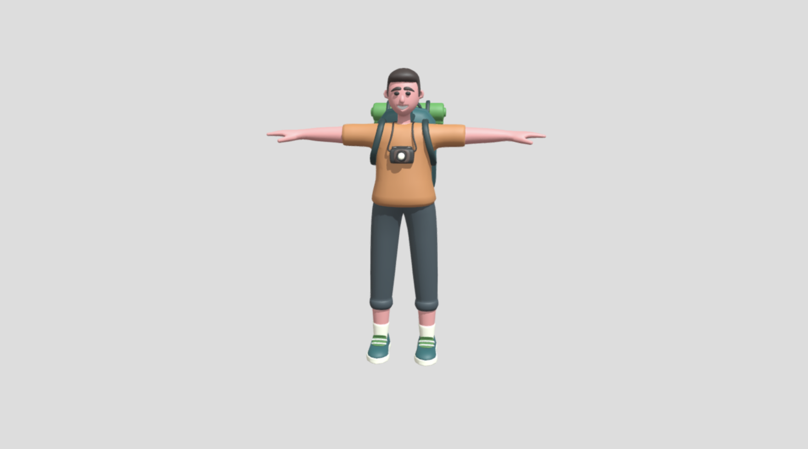 ([3D Model](https://sketchfab.com/3d-models/walk-man-ca5429ebe74944c7949f05270e99b359))
-   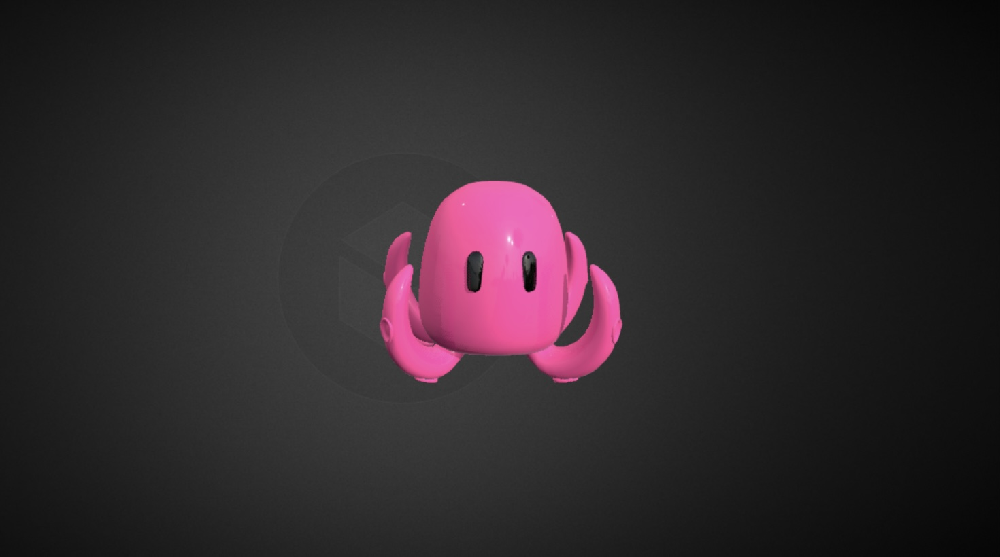 ([3D Model](https://sketchfab.com/3d-models/stylized-animated-octupus-afd522e7a5cb48bb98aea7c37879000d))
-   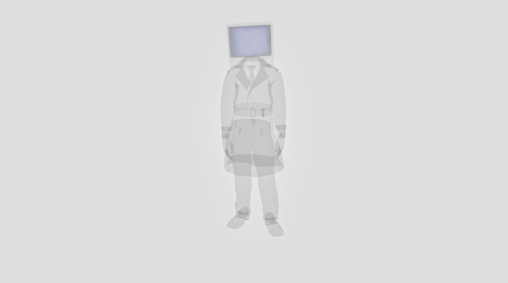 ([3D Model](https://sketchfab.com/3d-models/ghost-tv-man-f7bc9cc70236499fa09eb185728cf2e5))
-   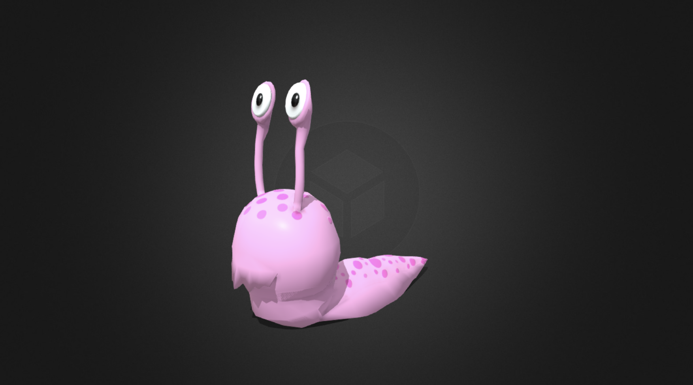 ([3D Model](https://sketchfab.com/3d-models/lowpoly-cute-monster-snail-three-animations-8bb433dfbef3479cbaa3bcdf63b5b6a2))
-   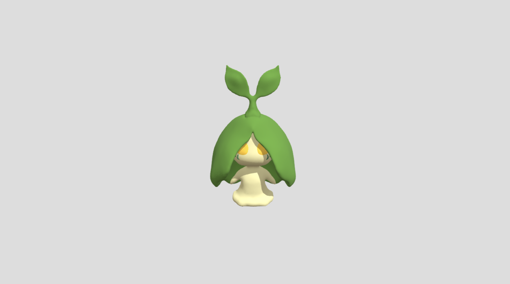 ([3D Model](https://sketchfab.com/3d-models/new-grass-type-starter-pokemon-seedle-aeb918813f8b4de29bd48aa3bd35d6eb))
-   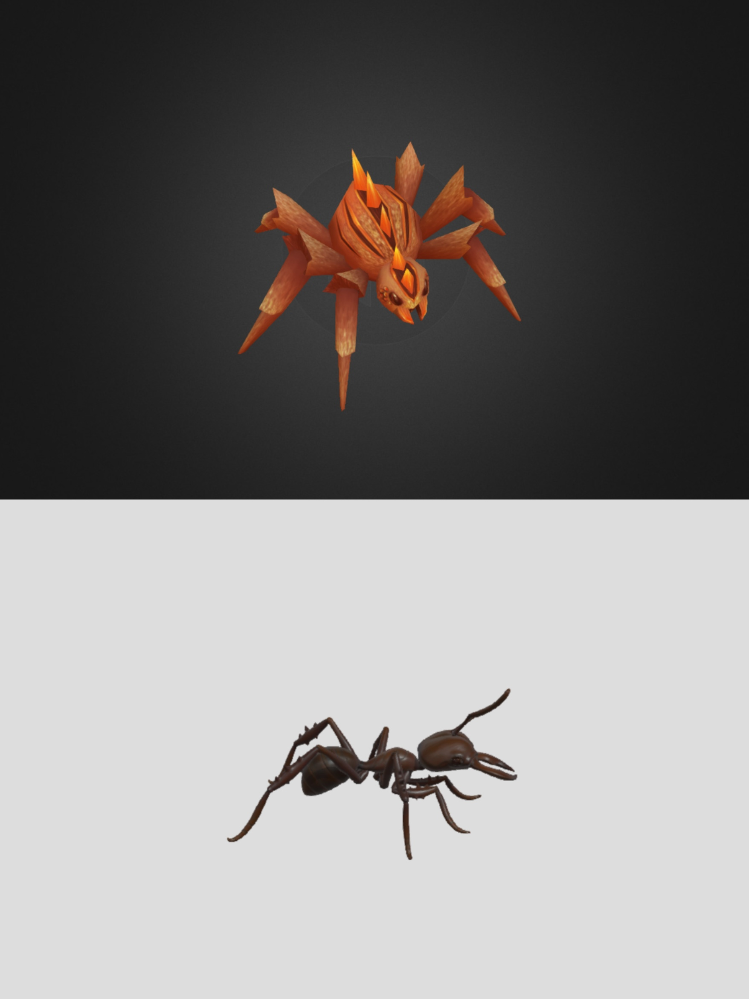 ([3D Model](https://sketchfab.com/3d-models/spider-low-poly-1029c25a78c543259167cdc72a9ae7a7), [3D Model](https://sketchfab.com/3d-models/walking-ant-dcf15f34876e4a90bd0ad67ef55fb9fe))
-   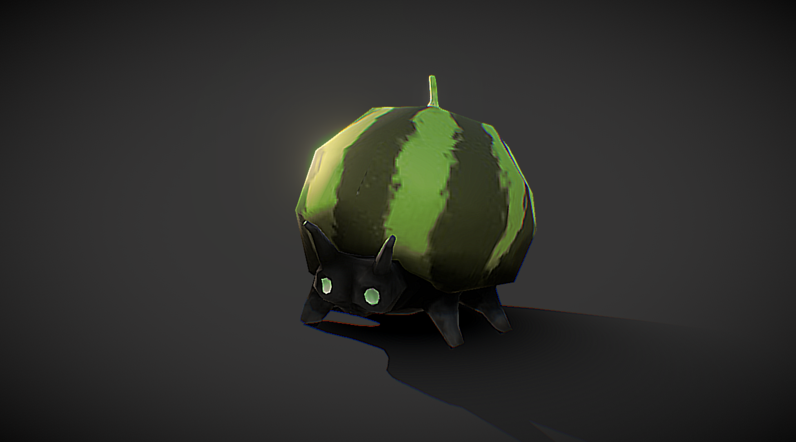 ([3D Model](https://sketchfab.com/3d-models/watermelon-bug-idle-f76e8cbeebcd4b1cae943ab7782ec22d))

Bases:

-   [Floating island with house](https://sketchfab.com/3d-models/stylized-3d-floating-island-and-mine-house-3cb24182a8504d439ee4e3c500565ac5), [Portal 1](https://sketchfab.com/3d-models/interdimensional-zen-gallery-space-1bd9d26e53e044eea56a2837ffd75136), [Portal 2](https://sketchfab.com/3d-models/floating-island-01-3d3460087e8b4494a3754d95619eed0b), [Floating island](https://sketchfab.com/3d-models/floating-island-192393b07d5d4e06a27e9ffc68ac5d89), [Floating treehouse](https://sketchfab.com/3d-models/floating-islands-of-the-west-dwarves-haven-644a09d37ffe4e86978ac8ef8d1b0e32)

Structures:

-   [Mushroom house (small)](https://sketchfab.com/3d-models/mushroom-house-d99d60b4c61a426cb3f8d30599e0c267), [Blue Magic house](https://sketchfab.com/3d-models/magic-house-98020ddd7c244e64aaa1d39dea6e12e9), [Mushroom house (big)](https://sketchfab.com/3d-models/muschroom-housetoadstool-7cbb2103fe2d468aa03417f31f9d667c), [Mushroom shop](https://sketchfab.com/3d-models/mushroom-house-ecbba166336d49ecaf57ee7a9ffccb44), [Cabin](https://sketchfab.com/3d-models/stylized-house-66ea8904172f453098283706bb8afec8), [Floating Cabin](https://sketchfab.com/3d-models/fantasy-island-9d56515291054b558fdbb747f5c74742), [Black Smith](https://sketchfab.com/3d-models/the-viking-blacksmith-dae-villages-0e01a1a363494481b2efc4ea9add8e32), [Small Cabin](https://sketchfab.com/3d-models/rts-human-house-lv2-proto-series-d186eaa8f042412db5964fe4a3e91a96)

Background decorations:

-   [Bird](https://sketchfab.com/3d-models/pigeon-5884a0f5200c44ceaa7d0399bea577f9), [Grass](https://sketchfab.com/3d-models/grass-arch-f5ae7d17dfae48a698ec0cc3809ed35b), [Glowing Grass](https://sketchfab.com/3d-models/stylized-tropical-grass-3494dc78d85e4b6cb1fb49dcb8b1364d), [Grass floor](https://sketchfab.com/3d-models/grass-autumn-update-8f3a475a07e84964bbfa7e6bdbab9782), [Flower floor](https://sketchfab.com/3d-models/phlox-candystrip-flower-cluster-caf0866c9f5f4e39bf73f25e22f51eb8), [Glowing mushroom](https://sketchfab.com/3d-models/glowing-mushroom-d-08fd71e5aaea403f8e407f7da2937873), [Mushrooms](https://sketchfab.com/3d-models/mushrooms-c2dbb88a5e9c4e82a180e13b472015ed), [Blue glowing mushroom](https://sketchfab.com/3d-models/glowing-mushroom-cfc2172e2c414b708d8eadcd38d27b0c), [Single mushroom](https://sketchfab.com/3d-models/mushroom-99cd3901e0f94cf7a621c89dfde9e86e), [Giant mushroom](https://sketchfab.com/3d-models/simple-mushroom-house-and-shimeji-5755066cd3804f76b118166598b2b249), [Pond](https://sketchfab.com/3d-models/flower-pool-b657aba3fbde4bc6ae75272173f52f93), [Flower 1](https://sketchfab.com/3d-models/lily-flower-b58f68ed6cbe4e4d8070185a888a8dc6), [Corn flower](https://sketchfab.com/3d-models/bromeliad-flower-f175f9207061436b85420354d3776ba7), [Orange flowers](https://sketchfab.com/3d-models/flower-0fa50cf622f44f2ba59eff6c11cb8fbd), [Egg flower](https://sketchfab.com/3d-models/genshin-impact-sweet-flower-read-desc-58029f5997dc412ba34b7b6905e7e464), [Flower 2](https://sketchfab.com/3d-models/d45e0228caf54a8b91055da132904e0b)

## User Interface (UI)

The menu page should look like this:  
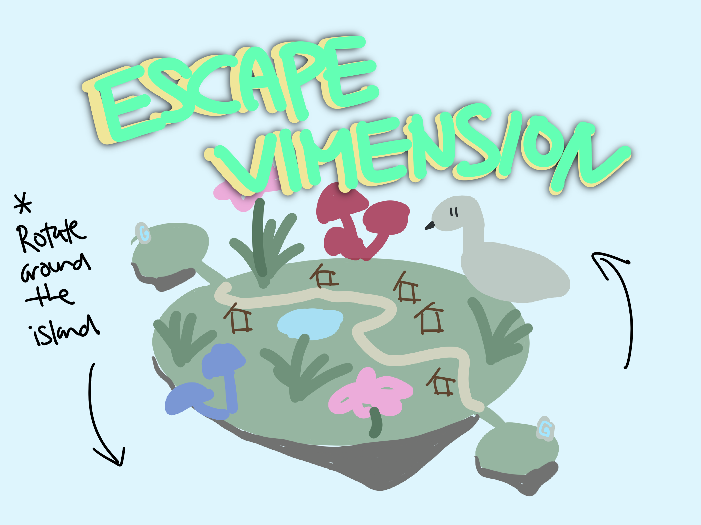

The player’s view in the background rotates around the entire world while the title remains fixed.

The gameplay page should look like this:  
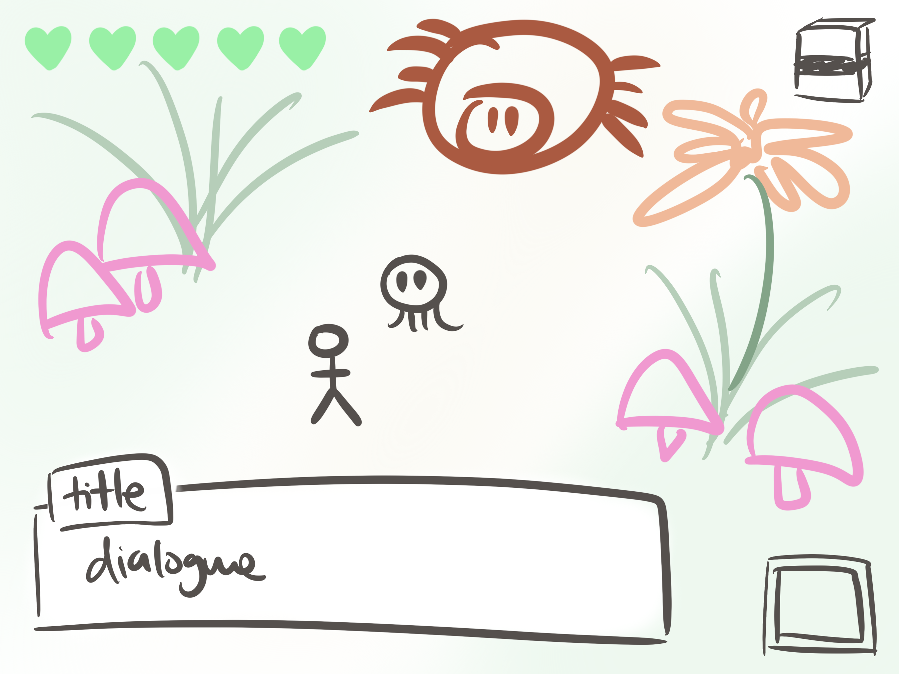

Here the player’s health is displayed in the top-left corner, a notebook button in the top-right corner, the dialogue box at the bottom of the page, and a single inventory slot in the bottom-right corner. The game is presented in 3D third-person perspective, with the camera following the player’s movements.

Since the game’s purpose is to provide a basic educational tutorial on Vim, we included a notebook page:  
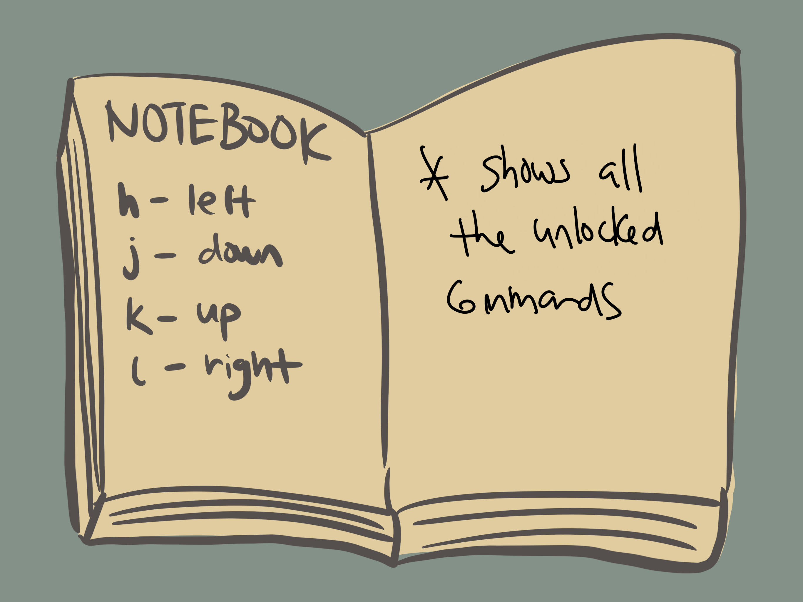

This page records all unlocked commands, allowing the player to review them during gameplay.

## Technology and Tools

To create **Escape Vimension**, our team will use the following software and tools:

-   **Unity 6000.1.9f1** ([Unity Hub](https://unity.com/)): The primary game engine
-   **C#**: Scripting language
-   **GitHub** ([GitHub](https://github.com/)): Version control to manage code and collaborate
-   **Blender** ([Blender](https://www.blender.org/)): _Optional_ 3D modelling and animation tool to customize or create new models if needed
-   **Audacity** ([Audacity](https://www.audacityteam.org/)): _Optional_ audio editing for trimming or adjusting soundtracks
-   **Discord**: Primary communication channel

## Communication, Timeline

**Communication**

-   **Primary Channel:** Discord for real-time chat and voice calls; GitHub Issues for task-specific discussions; WhatsApp for other communication.
-   **Documentation:** GitHub README file and Google Docs

---

**Timeline:**

-   **Week 1-2:** Core mechanics implementation, player movement, and basic environment
-   **Week 3-4:** Unlockable commands, puzzles, and initial UI setup
-   **Week 5:** Sound integration, environmental polish, testing, and bug fixes
-   **Week 6:** Final milestone submission, bug resolution, optimization, and README documentation

## Possible Challenges

1. **Technical Challenges**

    - Unity physics may behave unexpectedly when implementing Vim-command-based interactions
    - **Solution:** Prototype each command mechanic individually before integrating into the full game

2. **Time Constraints**

    - Limited time for polishing visuals, puzzles, and audio integration (As we are a team of 3)
    - **Solution:** Prioritize core mechanics and gradually add secondary features

3. **Asset Integration**

    - Imported 3D models and audio may have compatibility issues with Unity
    - **Solution:** Pre-test assets in isolated Unity scenes and maintain a consistent naming and folder structure

4. **Team Coordination**
    - Potential misalignment between team members on development priorities.
    - **Solution:** Weekly meetings, daily check-ins on Discord

## TODO

This document will be updated and modified as the project progresses.
