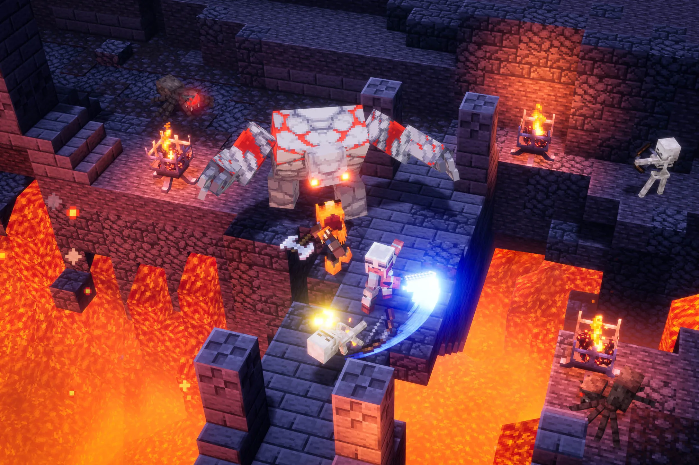
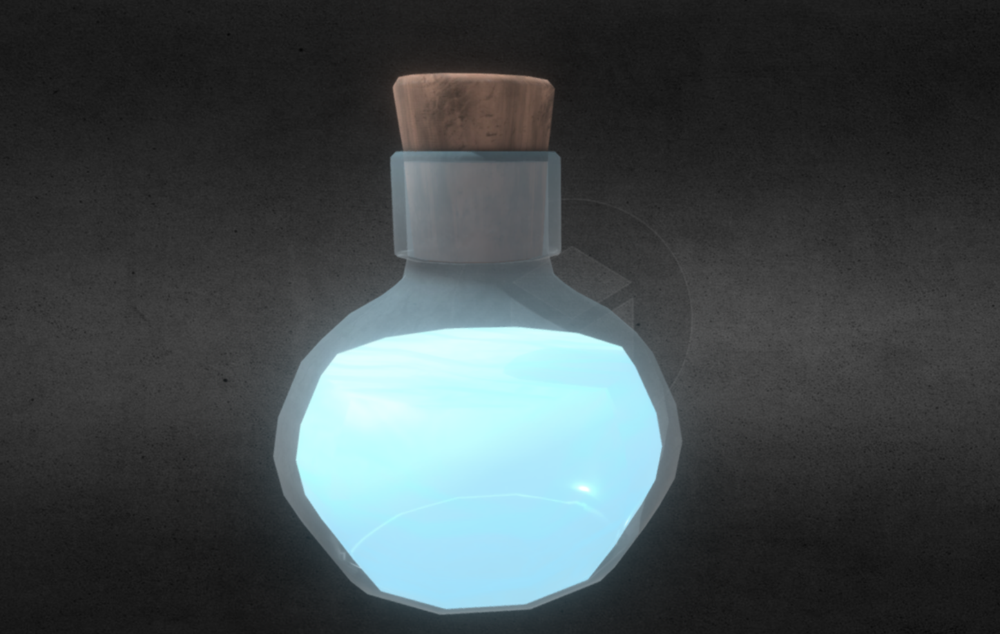
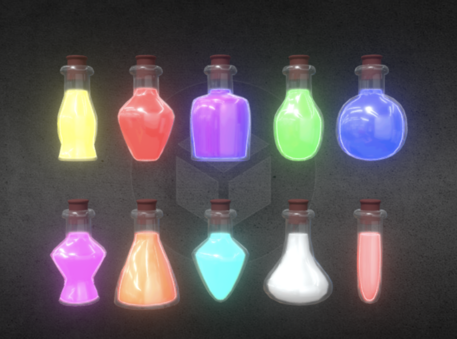
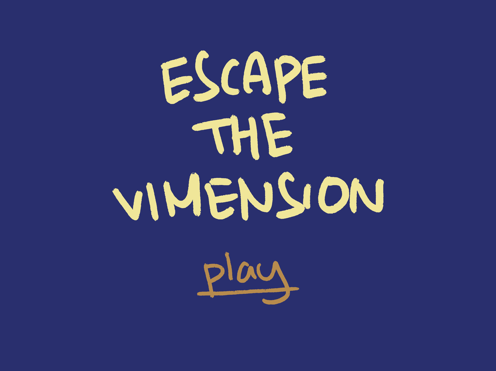
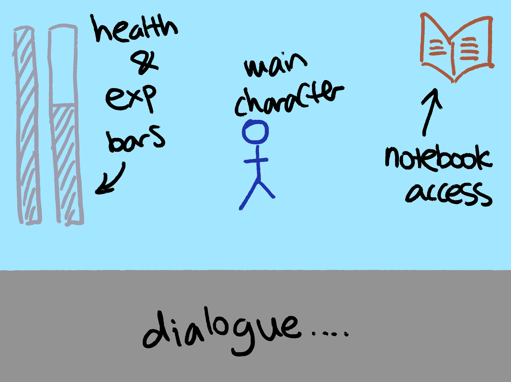
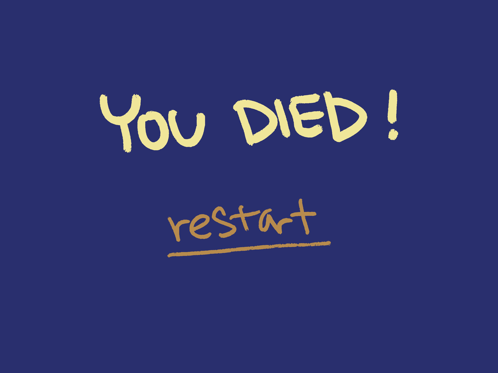
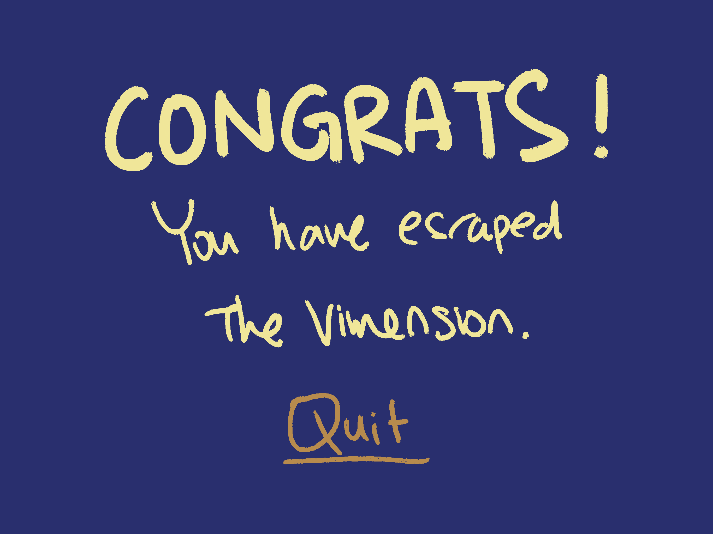
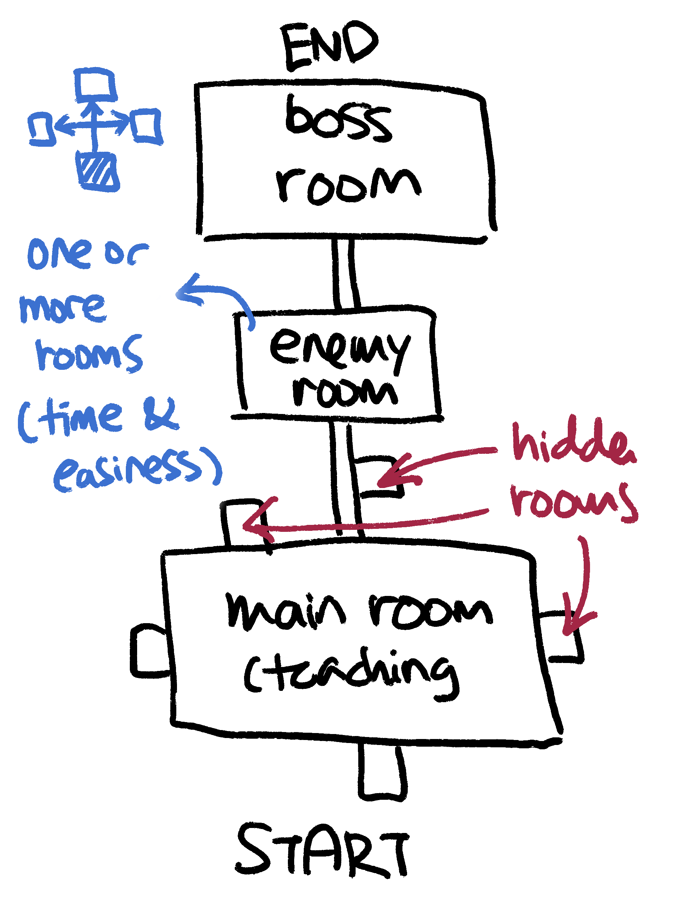

# Game Design Document: Escape Vimension

## Game Overview

### Core Concept

In **Escape Vimension**, the player is a programmer who wants to write code faster with Vim. As a complete newbie, the player enters the Vim editor without knowing how to quit it. After spending hours trying to exit Vim, the player is shrunk down and trapped inside a mysterious dungeon.

To escape back to the real world, you, the player, must master Vim commands by exploring the dungeon, defeating enemies, and growing in size and power. The journey of learning Vim is not as easy as it may seem.

Do you think you are built different? Can you master Vim? We will see…

---

### P.S. _What is Vim?_

Vim is a free, open-source, and highly configurable text editor that originated from the **vi** editor. Designed for efficiency and speed, it allows users to perform complex text-editing tasks entirely with keyboard commands through its command-line interface.

It is also known to have a steep learning curve, since most of us are used to relying on a mouse to move between lines. In Vim, you use the keyboard for everything!

---

### Related Genre(s)

-   **Primary Genre:** 3D Action-Adventure Dungeon Crawler
-   **Secondary Genre:** Educational Game

**Similar Games:**

-   _Vim Adventures_ (2D browser game teaching Vim)
-   _Human Resource Machine_ (programming puzzle game)
-   _The Legend of Zelda: Link's Awakening_ (dungeon exploration with item collection)

**What Makes Us Different:**  
Unlike text-based Vim tutorials or 2D educational games, we create an immersive 3D dungeon environment where Vim commands have immediate, visible physical effects on the world. Our game combines action-adventure gameplay with Vim learning, making the editor commands tangible and memorable.

---

### Target Audience

-   **Primary:** Computer science students (18–25) learning programming
-   **Secondary:** Developers wanting to learn Vim in a fun way
-   **Tertiary:** Action-adventure game enthusiasts who enjoy unique mechanics

**Accessibility:** No prior Vim knowledge required, the game teaches from scratch.

---

### Unique Selling Points (USPs)

-   **Physical Vim Commands:** Transform abstract text editing into tangible 3D interactions
-   **Learn by Doing:** No boring tutorials; every command is learned through combat and exploration
-   **Size-Based Progression:** Start tiny and grow larger as you master Vim commands
-   **Dungeon Exploration:** Discover secret rooms, traps, and enemies while learning

## Story and Narrative

### Backstory

You're a college student working late on a programming project. Frustrated with your slow editing speed, you stumble upon Vim. Eager to improve, you open a terminal and type `vim .`.

Confused, you realise you have no idea how to edit code, navigate, or most importantly, exit. In frustration, you mash through countless keyboard shortcuts, but nothing works… until you accidentally enter **Vimension**. Suddenly, you're shrunk down to the size of a microbe and trapped in a mysterious dungeon!

Now, the only way to return to reality is to master Vim, by exploring the dungeon, defeating enemies, and growing stronger with each command you learn.

---

### Setting

The game takes place in a mysterious dungeon filled with ancient secrets and dangerous creatures.

-   **Environment**

    -   Dark stone corridors and chambers creating a maze-like dungeon
    -   Secret rooms hidden behind walls and traps
    -   Ancient mechanisms and locked doors requiring keys
    -   Dangerous traps that teleport you back to the start

-   **Enemies**

    -   **Turtle Guard:** Defensive enemy that patrols the dungeon corridors
    -   **Cursor Boss:** The final boss - a massive cursor that sweeps across the battlefield

-   **Interactive Objects**

    -   **Experience Potions:** Level up and grow in size
    -   **Keys:** Unlock doors and secret passages
    -   **Ability Items:** Special items that unlock new Vim commands (like the Number 5 for dash ability)

---

### Characters

-   **The Player (You):** A tiny programmer trying to escape, shown as a small humanoid figure that grows larger as you level up
-   **The Vim Tutor (Guide):** A mysterious keyboard sound that guides the player and teaches Vim commands through dialogue

## Gameplay and Mechanics – Vim Code

### Player Perspective

The game uses a **third-person perspective** with a dynamic camera that follows the player and adjusts distance based on player size. This allows the player to see the dungeon environment clearly while maintaining a sense of scale as they grow.

---

### Controls

The player moves using **basic Vim commands**:

-   `h`, `j`, `k`, `l` → Move the player (left, down, up, right)
-   `x` → Pick up items
-   `1-5` + direction → Dash ability (unlocked by finding the Number 5 item)
-   `d` → Attack the enemy

---

### Progression

-   **Unlocked by default:** Basic movement (`h`, `j`, `k`, `l`) and attack (`d`)
-   **As the game progresses:** Additional abilities are unlocked by finding special items in the dungeon
-   **Levelling system:** Gain experience from potions and enemies to increase size, speed, and strength

---

### Rules

-   **Health:** The player has a health bar. If all health is lost → **Game restarts completely** (loads MainScene)
-   **Target:** Progress through the dungeon by collecting experience potions, keys, and ability items to unlock new commands and defeat the Cursor Boss
-   **Size Growth:** As you level up, you grow larger and become faster and stronger
-   **Respawn:** Death teleports you back to the very beginning of the dungeon

## World Design

### Game World

The world is set in a mysterious dungeon with:

-   **Stone corridors and chambers** creating a maze-like environment
-   **Secret rooms** hidden behind walls and mechanisms
-   **Traps** that teleport players back to the start
-   **Locked doors** requiring keys to progress
-   **Enemy patrol routes** and boss arenas

### Objects

-   **Experience Potions:** Restore health and grant experience points for levelling
-   **Keys:** Unlock doors and secret passages
-   **Ability Items:** Special collectibles that unlock new Vim commands
-   **Enemies:** Turtle guards and the Cursor Boss
-   **Traps:** Teleportation traps that send you back to the start

### Physics

-   Player collides with enemies, walls, and environmental obstacles
-   Dynamic camera system adjusts distance based on player size
-   Teleportation mechanics for traps and respawning
-   No movable objects - the dungeon is a fixed environment

## Art and Audio

The overall aesthetics of the game will be more 3D cartoon-like rather than realistic. Since our player is shrunk into a mysterious dungeon world, a more fantasy-like style suits the game design better.

---

### Art Style

The game features a dungeon aesthetic with:

-   **Dark stone environments** with atmospheric lighting
-   **Fantasy-style characters** and enemies
-   **Glowing potions** and magical items
-   **Dynamic lighting** that creates atmosphere

Similar game references:

-   The Legend of Zelda: Link's Awakening
-   Dark Souls (atmosphere)
-   Hollow Knight (dungeon exploration)

Online image references:

-   **Reference 1:**  
    

-   **Reference 2:**  
    

-   **Reference 3:**  
    

---

### Sound and Music

The game features atmospheric audio that enhances the dungeon exploration experience:

-   **Background Music:** Atmospheric dungeon music that creates tension and mystery:
    Source: [Medieval Village – Walen](https://freetouse.com/music/walen/medieval-village)

-   **Sound Effects:**
    Sourced from [Pixabay](https://pixabay.com/)
    -   Player movement sounds (walking, running):
    -   Combat sounds (attacks, enemy hits)
    -   Item pickup sounds (potions, keys)
    -   Level up sound effects
    -   Damage taken sounds
    -   Enemy attack sounds (turtle attacks, boss attacks)
-   **Dialogue Audio:** Typing sounds accompany dialogue to maintain immersion
    Source: [Epidemic Sound – Typing Effect](https://www.epidemicsound.com/sound-effects/tracks/11e80013-c1ae-4705-b557-8d8ff294d1ba/)

---

### Assets

Main characters:

-   **The Player:** A small humanoid figure that grows larger as you level up: [Main character](Images/MainCharacter.png)
-   **Turtle Enemies:** Defensive creatures that patrol the dungeon: [Turtle enemy](Images/Turtle.png)
-   **Cursor Boss:** A massive cursor that performs sweeping attacks: [Cursor Boss](Images/Cursor.png)

Environment:

-   **Dungeon tiles and walls** creating the maze-like environment
-   **Doors and mechanisms** for progression
-   **Traps and teleportation points**
-   **Secret rooms and hidden passages**

Items:

-   **Experience Potions:**  
    Glowing bottles that restore health and grant experience:  
      
    

-   **Keys:**  
    Metallic keys for unlocking doors:  
    

-   **Ability Items:**  
    Special collectibles like the Number 5:  
    

## User Interface (UI)

The gameplay interface features:

1. **Menu Page**  
   

2. **Game Main Interface**  
   

3. **Notebook Interface**  
   

4. **Death Ending Interface**  
   

5. **Game Ending Interface**  
   

6. **Game Map**  
   

-   **Experience Bar:** Vertical bar next to the health bar showing experience progress
-   **Dialogue Box:** At the bottom for Vim Tutor guidance and story
-   **Notebook:** Shows unlocked abilities

The game is presented in 3D third-person perspective, with the camera following the player's movements and adjusting distance based on player size.

## Technology and Tools

To create **Escape Vimension**, our team will use the following software and tools:

-   **Unity 6000.1.9f1** ([Unity Hub](https://unity.com/)): The primary game engine
-   **C#**: Scripting language
-   **GitHub** ([GitHub](https://github.com/)): Version control to manage code and collaborate
-   **Blender** ([Blender](https://www.blender.org/)): _Optional_ 3D modelling and animation tool to customise or create new models if needed
-   **Audacity** ([Audacity](https://www.audacityteam.org/)): _Optional_ audio editing for trimming or adjusting soundtracks
-   **WhatsApp**: Primary communication channel
-   **Discord**: Used for online meetings

## Communication, Timeline

**Communication**

-   **Primary Channel:** Discord for real-time chat and voice calls; GitHub Issues for task-specific discussions; WhatsApp for other communication.
-   **Documentation:** GitHub README file and Google Docs

---

**Timeline:**

-   **Week 1-2:** Core mechanics implementation, player movement, and basic environment
-   **Week 3-4:** Unlockable commands, puzzles, and initial UI setup
-   **Week 5:** Sound integration, environmental polish, testing, and bug fixes
-   **Week 6:** Final milestone submission, bug resolution, optimisation, and README documentation

## Possible Challenges

1. **Technical Challenges**

    - Unity physics may behave unexpectedly when implementing Vim-command-based interactions
    - **Solution:** Prototype each command mechanic individually before integrating into the full game

2. **Time Constraints**

    - Limited time for polishing visuals, puzzles, and audio integration (as we are a team of three)
    - **Solution:** Prioritise core mechanics and gradually add secondary features

3. **Asset Integration**

    - Imported 3D models and audio may have compatibility issues with Unity
    - **Solution:** Pre-test assets in isolated Unity scenes and maintain a consistent naming and folder structure

4. **Team Coordination**
    - Potential misalignment between team members on development priorities
    - **Solution:** Weekly meetings, daily check-ins on WhatsApp

## Art Resources used

1. **RPG Monster Duo PBR Polyart**
   ([Unity Asset Store](https://assetstore.unity.com/packages/3d/characters/creatures/rpg-monster-duo-pbr-polyart-157762))

2. **Rust Key**
   ([Unity Asset Store](https://assetstore.unity.com/packages/3d/props/rust-key-167590))

3. **Lite Dungeon Pack - Low Poly 3D Art by Gridness**
   ([Unity Asset Store](https://assetstore.unity.com/packages/3d/environments/dungeons/lite-dungeon-pack-low-poly-3d-art-by-gridness-242692))

4. **Jammo Character | Mix and Jam**
   ([Unity Asset Store](https://assetstore.unity.com/packages/3d/characters/jammo-character-mix-and-jam-158456))

5. **Open Book** ([OpenGameArt](https://opengameart.org/content/open-book))

6. **Casual Fantasy Book** ([Unity Asset Store](https://assetstore.unity.com/packages/2d/gui/icons/casual-fantasy-book-icon-pack-10-stylized-magic-books-320929))

7. **Experience Potion** ([Unity Asset Store](https://assetstore.unity.com/packages/3d/props/food/magic-potion-pack-free-low-poly-3d-model-319553))
